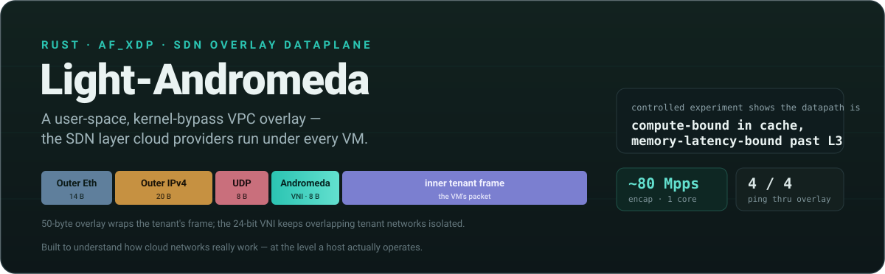
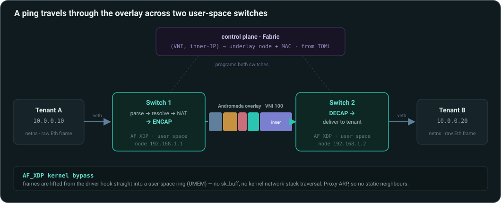
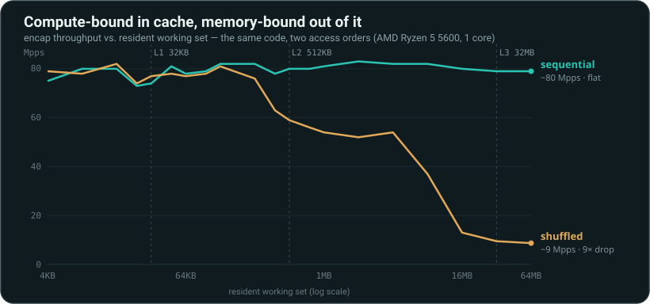

<p align="center">
  
</p>

<p align="center">
  
  
  
  
  
</p>

<p align="center">
  <b>What your VM thinks is a private network is really software on the host faking one.</b><br>
  This is that software, in miniature — built from scratch to understand it byte by byte.
</p>

<p align="center">
  📄 <a href="https://rars-oss.github.io/light-andromeda/report.html">Technical report</a> &nbsp;·&nbsp;
  🧪 <a href="https://rars-oss.github.io/light-andromeda/playground.html">Packet playground</a> &nbsp;·&nbsp;
  📘 <a href="docs/REPORT.md">Full write-up</a>
</p>

---

Cloud providers don't give a virtual machine a real network. They give it the
*illusion* of one — a private address space stitched across a shared physical fabric
by software running on every host (Google's is **Andromeda**; the pattern is **SDN**
with **VXLAN/GENEVE** encapsulation). **Light-Andromeda** is a working miniature of
that software: it parses packets by hand, wraps them in a custom overlay, forwards
them by a centrally-programmed map, translates addresses in flight, and moves them
**in user space past the kernel's network stack** with `AF_XDP`. A real ping travels
end-to-end through it.

## See it in 30 seconds — no root, no Linux needed

```bash
cargo run -p andromeda-cli -- inspect     # decode a real overlay packet, layer by layer
```
```text
Ethernet  02:00:00:00:a1:01 -> 02:00:00:00:a1:02  ethertype 0x0800 (IPv4)
  IPv4  192.168.1.1 -> 192.168.1.2  proto 17 (UDP)  ttl 64  len 90  cksum ok
    UDP  57553 -> 43481  len 70
      Andromeda  v1  VNI 100  flow 0x60d1  hop 64
      -- inner frame --
        Ethernet  02:00:00:00:00:0a -> 02:00:00:00:00:0b  ethertype 0x0800 (IPv4)
          IPv4  10.0.0.10 -> 10.0.0.20  proto 17 (UDP)  ttl 64  cksum ok
```
```bash
cargo test --workspace                    # 49 tests
cargo run -p andromeda-cli -- bench        # performance table (mean ± sd)
```

## What it is

<p align="center"></p>

A **data plane** (fast, per-packet) and a **control plane** (slow — "where does
`10.0.0.20` live?") — the same split a real SDN uses. The inner tenant frame is
wrapped as L2-over-UDP with an 8-byte header carrying a **24-bit VNI** (so overlapping
tenant `10.0.0.0/24`s stay isolated) and a **flow hash** (so the underlay's ECMP can
spread flows without opening the tunnel).

## A real ping travels through the overlay

`sudo ./scripts/demo-2node.sh` builds two tenants in separate namespaces and two
independent user-space switches, then pings **through** the overlay — encapsulate on
one node, decapsulate on the other, no static ARP, no kernel forwarding in between:

```text
64 bytes from 10.0.0.20: icmp_seq=1 ttl=64 time=0.38 ms
--- 10.0.0.20 ping statistics ---
4 packets transmitted, 4 received, 0% packet loss

# each switch prints a live line:  [+3s] rx 26 tx 5  encap 2 decap 2 arp 1
```

The switch pulling packets into user space **before the kernel stack sees them** is
the "OS bypass." (In dump mode the ping gets *zero* replies — because the frames never
reach the host's IP stack. That 100% "loss" is the proof.)

## Is it fast? And is it compute- or memory-bound?

The encapsulation core went from **19 to ~80 Mpps on one core** through six changes
(header templating, zero-copy in-place encap, a zero outer UDP checksum à la VXLAN, an
`FxHashMap` resolve, a parallel flow hash, fat LTO). But the interesting result is a
**controlled experiment** — throughput vs. working-set size under sequential vs.
random access:

<p align="center"></p>

Sequential access is **flat at ~80 Mpps across five orders of magnitude** — the
prefetcher hides all latency, so the code is **compute-bound**. Random access tracks
the cache hierarchy exactly and collapses **9×** past L3 — **memory-latency-bound**.
The regime depends on locality, not the code; reporting only the cache-hot number
would overstate throughput by up to 9×. *This experiment refuted the author's own
first guess* — the full roofline model and threats to validity are in the
[technical report](docs/REPORT.md). Run it yourself: `andromeda bench --sweep`.

## What's inside (the concepts on display)

| Concept | Where it lives |
|---|---|
| **OS bypass / user-space packet processing** | AF_XDP RX/TX rings over a shared UMEM; a ~170-line C shim over system `libxdp` |
| **Manual wire-format parsing** | Ethernet / IPv4 / UDP / TCP / ARP parsed and built by hand, zero-copy over borrowed slices |
| **Incremental checksums (RFC 1624)** | Address/port rewrites patch L3+L4 checksums by 16-bit delta — proven bit-identical to a full recompute |
| **Overlay encapsulation (VPC)** | Custom 8-byte header: 24-bit VNI + flow hash; header templating on the hot path |
| **SDN control plane** | Fabric map `(VNI, inner-IP) → node + MAC`, from declarative TOML |
| **Multi-tenancy** | Multiple VPCs per switch, isolated by VNI — the same inner IP in two tenants routes to different endpoints (unit-tested) |
| **Stateful NAT** | SNAT/PAT with conntrack + a port allocator; DNAT port-forwarding |
| **Distributed gateway** | Proxy-ARP with one virtual gateway MAC — tenants never learn each other's MACs |
| **Systems Rust** | `#![forbid(unsafe_code)]` in the core; allocation-free hot path; `unsafe` confined to the FFI |
| **Property / fuzz testing** | `proptest`: parsers never panic on random bytes, `decap(encap(x)) == x`, checksums bit-identical — over thousands of generated cases |

## How it's built

```
crates/
├── andromeda-core/       # wire formats, checksums, the Andromeda overlay — no deps, no unsafe
├── andromeda-nat/        # stateful SNAT/DNAT + connection tracking
├── andromeda-control/    # VPC/endpoint fabric map + TOML config
├── andromeda-dataplane/  # the per-packet pipeline + the AF_XDP ring loop (csrc/xsk_shim.c)
└── andromeda-cli/        # `andromeda`: selftest / bench / inspect / run / switch
```

## Try the interactive playground

**[▶ Open the packet playground](https://rars-oss.github.io/light-andromeda/playground.html)** — build a tenant packet in your
browser and watch it get wrapped in the overlay: a color-linked layer stack and hex
dump (hover a layer to light up its bytes), live checksums, and the flow hash. Its
JavaScript byte-assembly is **verified to produce packets that `andromeda inspect`
decodes byte-for-byte identically** — two independent implementations agreeing on the
wire format.

## Build & run everything

```bash
# portable (any OS, no root):
cargo test --workspace
cargo run -p andromeda-cli -- bench           # mean ± sd performance table
cargo run -p andromeda-cli -- bench --sweep   # the cache-hierarchy experiment

# one command with Docker:
docker build -t andromeda . && docker run --rm andromeda bench

# the real kernel-bypass datapath (Linux + libxdp, root):
sudo apt-get install -y libxdp-dev libbpf-dev clang m4 pkg-config
cargo build --release -p andromeda-cli --features afxdp
sudo ./scripts/demo-2node.sh                  # ping through the overlay
sudo ./scripts/demo.sh bypass                 # watch RX bypass the kernel
```

Requires a recent stable Rust toolchain; the AF_XDP path needs a Linux kernel with
`CONFIG_XDP_SOCKETS=y` (verified on 6.6).

## Status & roadmap

**Done:** byte-exact L2/L3/L4 + ARP parsing · Andromeda overlay · incremental
checksums · SNAT/DNAT + conntrack · SDN fabric + TOML config · proxy-ARP gateway ·
**multi-VPC (tenant isolation by VNI — same inner IP in two VPCs stays separate)** ·
AF_XDP datapath · two-node overlay ping · header templating + zero-copy encap ·
rigorous benchmarks + the cache experiment · 49 tests (incl. property/fuzz), CI, clippy/fmt clean.

**Next:** native-mode zero-copy AF_XDP on a real NIC (with PMU data) · a live
multi-tenant-port switch · IPv6/ND · MAC learning · shared-UMEM zero-copy across both ports.

## Docs

- **[Technical report (visual)](https://rars-oss.github.io/light-andromeda/report.html)** — the story with charts
- **[Technical report (Markdown)](docs/REPORT.md)** — abstract, related work, methodology, evaluation, roofline, threats to validity, references
- **[Packet playground](https://rars-oss.github.io/light-andromeda/playground.html)** — interactive overlay builder
- **[Architecture notes](docs/ARCHITECTURE.md)** — the packet walk

## Contributing & license

Contributions and questions welcome — see [CONTRIBUTING.md](CONTRIBUTING.md). MIT
licensed. If you find this interesting, a ⭐ helps others find it.

<sub>Built to understand how cloud networks really work — at the level a host actually operates.</sub>
